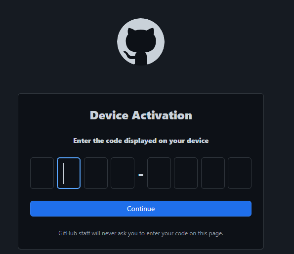

> In this setup I use [Windows PowerShell](https://learn.microsoft.com/en-us/powershell/scripting/overview?view=powershell-7.4) is a shell to setup

## Application manage

> I used `winget` and `scoop`

### winget

It default install or your can install in [microsoft store](https://apps.microsoft.com/detail/app-installer/9NBLGGH4NNS1?hl=en-US&gl=US)

### scoop

[Scoop](https://scoop.sh/) is a command-line installer for Windows. It can install app and plugins not need role admin.
Open a `PowerShell terminal`

```bash
Set-ExecutionPolicy RemoteSigned -Scope CurrentUser
irm get.scoop.sh | iex
```

## Git

### Install git

**winget**

```bash
winget install Git.Git
```

**or by scoop**

```bash
scoop bucket add main
scoop install main/git
```

### Fast SignIn Github

> Login Github in browser by command line [Learn more](https://cli.github.com/)

1. Login Github in your browser
2. Install Github CLI

**winget**

```bash
winget install GitHub.cli
```

**or scoop**

```bash
scoop bucket add main
scoop install main/gh
```

3. SignIn Github
   _Run command_

```bash
gh auth login
```

**My setup**

**After it press enter and enter code has generate**


### Git GUI

My option is [Fork](https://git-fork.com/). Many others Git GUI like [SourceTree](https://www.sourcetreeapp.com/), [GitKraken](https://www.gitkraken.com/) and [Git Cola](https://git-cola.github.io/), ect...
`Fork` is friendly, easy to use for me.
To install run

```bash
winget install Fork.Fork
```

## Text Editor

My choices are [VSCode](https://code.visualstudio.com/) and [Neovim](https://neovim.io/)

### VSCode

```bash
scoop bucket add extras
scoop install extras/vscode
```

### Neovim

```bash
scoop bucket add main
scoop install main/neovim
```

## Terminal

My choice is **Windows Terminal**. You can choose other Terminal like: [WezTerm](https://wezfurlong.org/wezterm/install/windows.html), [Hyper](https://hyper.is/) and [ConEmu](https://conemu.github.io/).


### Installing Windows Terminal

It default in Windows 11. For manual install in [Microsoft Store](https://apps.microsoft.com/detail/9N0DX20HK701?hl=en-US&gl=US) in Windows 10.

### Terminal Theme ([Oh My Posh](https://ohmyposh.dev/docs/installation/windows))


#### Install Oh My Posh

**winget**

```bash
winget install JanDeDobbeleer.OhMyPosh -s winget
```

**scoop**

```bash
scoop install https://github.com/JanDeDobbeleer/oh-my-posh/releases/latest/download/oh-my-posh.json
```

#### Next after install OhMyPosh

1. Install font: [Nerd Font](https://github.com/ryanoasis/nerd-fonts)
I choice `Hack Nerd Font` install by scoop

```bash
scoop bucket add nerd-fonts
scoop install nerd-fonts/Hack-NF
```

2. Setting Font in Windows Powershell
3. Choice a theme in [this](https://ohmyposh.dev/docs/themes)
4. [Config prompt](https://ohmyposh.dev/docs/installation/prompt)
5. Custom display ([learn more](https://ohmyposh.dev/))


## Node

In working, multiple projects with Node with different node version. So to fast switch nodejs version you need use tool to manage it. If you manual install when need re-install to switch version is very uncomfortable. Even Nodejs itself recommends that we use a tool to manage version in [this link](https://nodejs.org/en/learn/getting-started/how-to-install-nodejs).

### NVM

#### Install

**winget**

```bash
winget install CoreyButler.NVMforWindows
```

**scoop**

```bash
scoop bucket add main
scoop install main/nvm
```

#### Usage

- `nvm install <version>` install nodejs with version.
- `nvm list` show list node version have install.
- `nvm use <version>` switch node version. Need open PowerShell with **Run as administrator**

### FNM

#### Install FNM

**winget**

```bash
winget install Schniz.fnm
```

**scoop**

```bash
scoop bucket add main
scoop install main/fnm
```

#### After install FNM

- In PowerShell run `code $PROFILE` or your not have VSCode run `notepad $PROFILE`
- Insert `fnm env --use-on-cd | Out-String | Invoke-Expression` into file and close
- Reset your shell

#### Usage FNM

> Similar NVM
